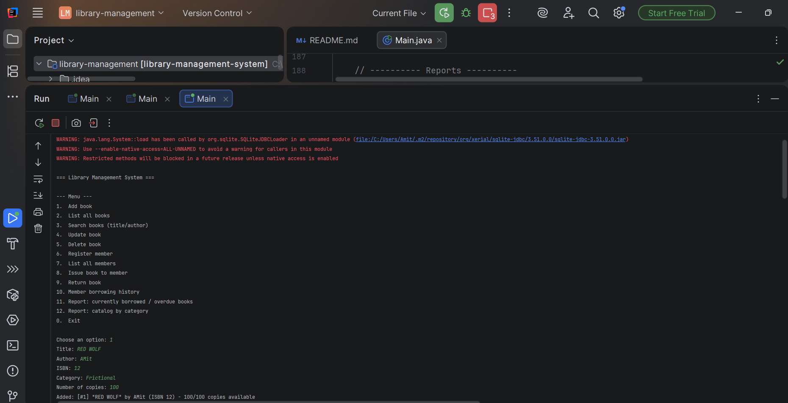
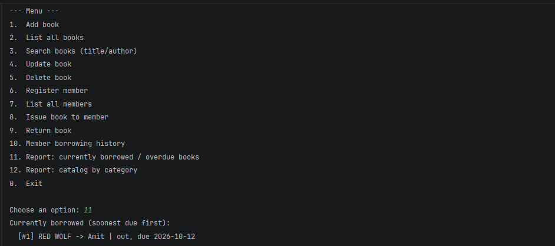
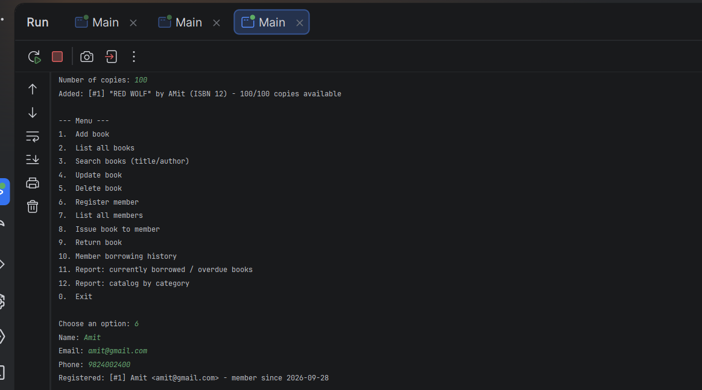

# Library Management System

A terminal-based Java application for managing a library's book catalog,
member registrations, and borrowing/returning activity. It stores all
records in a relational database through JDBC, so data persists between
runs. The project demonstrates object-oriented design, the Java
Collections Framework, and parameterised SQL queries.

## Features implemented

- Add, update, delete, and search books by title/author (catalog CRUD)
- Register and list library members
- Issue a book to a member, with:
  - a check that blocks issuing when zero copies are available
  - a check that blocks issuing the same book twice to the same member
  - automatic 14-day due date assignment
- Return a book, which restores the available copy count
- View a member's full borrowing history
- Report: all currently borrowed books, sorted by due date, flagged as
  overdue where relevant
- Report: catalog broken down by category
- Menu-driven console UI with input validation (rejects non-numeric input,
  rejects empty required fields, re-prompts instead of crashing)

## Technologies used

- Java 17 (meets the JDK 11+ requirement)
- JDBC with [SQLite JDBC driver](https://github.com/xerial/sqlite-jdbc) (`org.xerial:sqlite-jdbc:3.51.0.0`)
- SQLite (file-based, zero setup — see note below on swapping to MySQL/Postgres)
- Maven for build/dependency management

## Project structure

```
src/main/java/com/library/
  model/      Entity (abstract), Book, Member, Loan
  exception/  BookNotAvailableException, RecordNotFoundException
  dao/        BookDAO, MemberDAO, LoanDAO  (all JDBC, PreparedStatement only)
  service/    LibraryService                (business rules, Collections usage)
  main/       Main                          (Scanner-driven console menu)
src/main/resources/
  schema.sql                 table definitions, also runnable standalone
  config.properties.example  copy to config.properties to configure the DB URL
schema.sql                   (copy at project root, used when running from source)
```

## Database setup

The app creates its own tables automatically on first run (`DatabaseManager.initializeSchema()`
runs `schema.sql` against the configured database if the tables don't exist
yet), so **no manual setup is required for SQLite**. The schema is:

```sql
CREATE TABLE IF NOT EXISTS books (
    id INTEGER PRIMARY KEY AUTOINCREMENT,
    title TEXT NOT NULL,
    author TEXT NOT NULL,
    isbn TEXT NOT NULL UNIQUE,
    category TEXT NOT NULL,
    total_copies INTEGER NOT NULL,
    available_copies INTEGER NOT NULL
);

CREATE TABLE IF NOT EXISTS members (
    id INTEGER PRIMARY KEY AUTOINCREMENT,
    name TEXT NOT NULL,
    email TEXT NOT NULL UNIQUE,
    phone TEXT,
    join_date TEXT NOT NULL
);

CREATE TABLE IF NOT EXISTS loans (
    id INTEGER PRIMARY KEY AUTOINCREMENT,
    book_id INTEGER NOT NULL REFERENCES books(id),
    member_id INTEGER NOT NULL REFERENCES members(id),
    issue_date TEXT NOT NULL,
    due_date TEXT NOT NULL,
    return_date TEXT
);
```

The full script also lives at `schema.sql` in the project root and
`src/main/resources/schema.sql`.

### Configuring the database connection

Credentials/URLs are **not** hardcoded. `DatabaseManager` reads the DB URL from,
in order: `src/main/resources/config.properties` → the `LIBRARY_DB_URL`
environment variable → a safe local SQLite default.

```bash
cp src/main/resources/config.properties.example src/main/resources/config.properties
# edit config.properties if you want a different file path
```

`config.properties` is listed in `.gitignore` so it's never committed.

**Using MySQL or PostgreSQL instead:** add the matching JDBC driver
dependency to `pom.xml`, then set `db.url` to something like
`jdbc:mysql://localhost:3306/library?user=USER&password=PASS` (or read
user/password from environment variables in `DatabaseManager` instead of
embedding them in the URL, for stricter credential hygiene). The rest of
the DAO code is standard JDBC and needs no changes beyond the connection
string, since all queries use ANSI SQL.

## Setup and run instructions

Requires JDK 17+ and Maven.

```bash
# Build a runnable jar with the SQLite driver bundled in
mvn clean package

# Run it
java -jar target/library-management-system.jar
```

Or, without Maven, compiling by hand against a manually downloaded
`sqlite-jdbc-3.51.0.0.jar`:

```bash
javac -cp sqlite-jdbc-3.51.0.0.jar -d out $(find src/main/java -name "*.java")
java -cp out:sqlite-jdbc-3.51.0.0.jar com.library.main.Main   # macOS/Linux
java -cp "out;sqlite-jdbc-3.51.0.0.jar" com.library.main.Main # Windows
```

## Sample session

```
=== Library Management System ===

--- Menu ---
1.  Add book
2.  List all books
3.  Search books (title/author)
4.  Update book
5.  Delete book
6.  Register member
7.  List all members
8.  Issue book to member
9.  Return book
10. Member borrowing history
11. Report: currently borrowed / overdue books
12. Report: catalog by category
0.  Exit

Choose an option: 8
Book ID: 1
Member ID: 1
Issued: [#1] The Pragmatic Programmer -> Ada Lovelace | out, due 2026-10-12

Choose an option: 8
Book ID: 1
Member ID: 2
"The Pragmatic Programmer" has no available copies right now.
```

## Screenshot

**Adding a book**


**Currently borrowed / overdue report**


**Registering Member**


## Known limitations

- No fine calculation for overdue returns (listed as a stretch goal in the
  brief — not implemented here).
- No reservation/waitlist queue for fully-checked-out books.
- Search is a simple `LIKE` match on title/author; no full-text search.
- Single-user console app — no concurrent-access handling beyond what
  SQLite provides by default.
